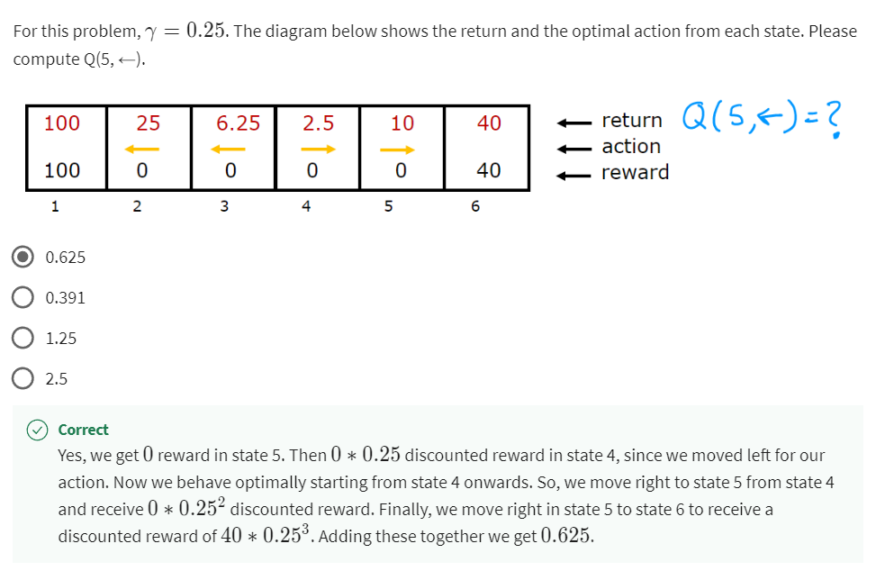

## Week 1 - Clustering

### What is clustering?
No labelling of target (Y), instead we used clustering algorithms to find interesting structure in data. 

Applications like:
- Grouping similar news
- Market segmentation
- DNA analysis (group them to people with similar traits)
- Astronomical data analysis (which one form galaxy or coherent structures in space)

### K-Mean Clustering
#### Steps:
1. Randomly initialize K cluster centroids $\mu1, \mu2, ..., \mu K $
    - Randomly pick K from training examples.
        - Run it multiple times to allow finding the best local optima.
        - Repeat: Random initialize -> Step 2 -> compute cost function (distortion)
        - Pick set of clusters that gave lower cost.
2. ```math
    Repeat{
        # Assign points to cluster centroids: 
            for i = 1 to m: 
                c^(i) := index (from 1 to K) of cluster centroid closest to x(i)

        # Move cluster centroids
        for k = 1 to K,
            Mu(k):= avg(mean) of points assigned to cluster k
    ```
Eliminate cluster if no point assigned to it.

#### Optimization objective
- Cost Function = Avg. distance from cluster centroid

$ J(c^{(1)}, ..., c^{(m)}, \mu_1,.. \mu_K) $ or distortion function = $ {1 \over m} \sum_{i=1}^{m} ||x^{(i)} -  \mu_{c^{(i)}}||^2 $

- $ c^{(i)} $ = index of cluster (1,2,..., K) to which example $ x^{(i)} $ is currently assigned
- $ \mu_k $ = cluster centroid k
- $ \mu_{c^{(i)}} $ = cluster centroid of cluster to which example $ x^{(i)} $ has been assigned

#### Choosing the number of clusters
- Elbow method: Find bend in the curve (elbow) and picked the K, might be too smooth for elbow to appear.
- Evaluate K-means based on a metric for how well it performs for that later purpose. 

## Week 1 - Anomaly detection
- Density Estimation based on probability of appearing in a region
- Assume data is in Gaussian (normal) distribution ($\sigma^2$ (variance) = maximum likelihood estimation)
### Steps:
1. **Choose n features** $x_i$ that I think might be indicative of anomalous examples.
1. Fit parameters
1. Given new example x, compute p(x) (based on prob of feature a X b X ...)
Anomaly if p(x) < $\epsilon$

### Evaluate
- Anomalous data points should be in CV or Test

1. Fit model p(x) on **training set** x(1),...,x(m)

1. On a **cross validation/test** example x, predict
    ```
    y = 1 if p(x)< e (anomaly)
    y = 0 if p(x)>= e (normal) 
    ```
Possible evaluation metrics:
- True positive, false positive, false negative, true negative
- Precision/Recall
- F1-score

### Anomaly detection vs Supervised Learning
| Anomaly detection      | Supervised Learning |
| ----------- | ----------- |
| Very small number of positive examples (y = 1). (0-20 is common). Large number of negative (y =0) examples. | Large number of positive and negative examples.
Many different "types" of anomalies. Hard for any algorithm to learn from positive examples what the normalies look like; **future anomalies may look nothing** like any of the anomalous examples we've seen so far.     | Enough positive examples for algorithm to get a sense of what positive examples are like, **future positive examples likely to be similar to ones in training set**. |
| <li>Fraud Detection <li>Manufacturing - Finding new previously unseen defects in manufacturing <li> Monitoring machines in data center | <li> Email spam classification <li> Manufacturing - Finding known previously seen defects (like scratches or bending) <li> Weather prediction (sunny/rainy/etc.) <li> Disease classification |

Building an anomaly detection algorithm, the choice of features is very important and when building anomaly detection systems. Tuning features is important for anomaly detection.

### Choosing features to use
- Must use gaussian features (e.g. can transform to gaussian with log(x) or $x^{1/2 or 3...}$)
- Error analysis for anomaly detection
    - Want p(x)< epsilon (abnormal) is small while p(x)>= epsilon (normal is large) in cross validation set 
    - Most common problem: p(x) is comparable (say, both large) for normal and anomalous examples
    - Can resolve by adding more meaningful features = number of transactions + typing speed of user
- Choose features that might take on unusually large or small values in the event of an anomaly.

## Week 2 - Collaborative Filtering


## Week 3 - Reinforcement Learning
Based on setting reward function and let the algorithm to automatically figure out how to choose good actions.

### Return in RL
- Discount Factor $\gamma$ = Cost for each move, usually 0.9/0.99.
If discount factor is small, the algorithm will be impatient, trying to find the nearest goal even when the reward isn't the highest.
- To summarize, the return in reinforcement learning is the sum of the rewards that the system gets, weighted by the discount factor, where rewards in the far future are weighted by the discount factor raised to a higher power. Now, this actually has an interesting effect when you have systems with negative rewards. 
- Discount factor actually incentivizes the system to push out the **negative** rewards as far into the future as possible
- Return = $R_1 + \gamma R_2 + \gamma^2 R_3 + ...$

### Making Decisions
- Policy = $\pi(s) = a0$

### State action value function (Q-function or $Q^*$)
- start in state s
- take action a(once)
- then behave optimally after that
The best possible return from state s is maxQ(s,a)

#### Bellman equation
$Q(s,a) = R(s) + \gamma \max\limits_{a'} Q(s',a')$

#### Stochastic Approach
Expected Return = Average ($R_1 + \gamma R_2 + \gamma^2 R_3 + ...$)
$Q(s,a) = R(s) + \gamma E[\max\limits_{a'} Q(s',a')]$

### Continuous state spaces
For actual case, instead of discrete case, there can be inputs based on continuous.

### Deep Reinforcement Learning
Create x->y for training in supervised learning to use Bellman Equation

x = Q(s,a)

y = R(s) + \gamma E[\max\limits_{a'} Q(s',a')]$

#### Learning Algorithm (Deep Q Network)
Initialize neural network randomly as guess of Q(s,a)

Repeat{

    Take actions in the lunar lander. Get (s, a, R(s),s').
    Store 10,000 most recent (s,a,R(s),s') tuples. (Replay buffer)
}

Train neural network:

- Create training set of 10,000 examples using

- x = (s,a) and y = R(s) + $\gamma \max\limits_{a'} Q(s',a')$

- Train Qnew such that $Q_{new}(s,a) \approx y$

$Q = Q_{new}$

#### Choosing actions while still learning
In some state s, option:
1. Pick the action a that maximizes Q(s,a)
1. - With prob 0.95, pick the action a that maximizes Q(s,a) (GREEDY)
    - With prob 0.05, pick an action a randomly (EXPLORATION)
    - $\epsilon - Greedy Policy(\epsilon = 0.05)$
    - Usually start $\epsilon$ high and gradually decrease (1 -> 0.01)

#### Tuning RL (Mini-batch and soft updates)
RL can be finicky to tune the parameters compared to supervised learning
- Mini-batch: Use different subset of training data for each gradient descent run, to be less costly / faster for large training set.
- Soft update: Allow soft update of Q, by accepting small update of Qnew to Q.

#### Limitation of RL
- Much easier to get to work in a simulation than a real robot
- Far fewer applications than supervised and unsupervised learning
