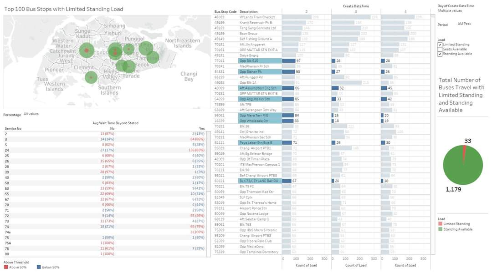

# The Movies Project

The impact of the 02/01/2018 train breakdown on the Waiting Time and Load situation of all public buses in Singapore using LTA Data Mall API were analyzed in 2018.

As part of my analysis, I compared the peak load of bus services during the peak AM hours of train breakdowns with the normal periods (comparing data from 02/01 with normal load 03/01 and 04/01)

A few examples of its use are as follows:

- Impact analysis of the effect of train breakdown on public buses

- Highlighting the bottleneck of current bus services.

- Highlighting bus services that fail to meet the bus frequency stipulated

Attached is a dashboard created using Tableau and with data processed from LTA Data Mall API.

Using it, I highlighted the **Top 10 Bus Stops and Services most negatively impacted**, and the additional wait time caused by the 02/01/2018 Train Breakdown.

<!-- ## Search Movies

 -->



